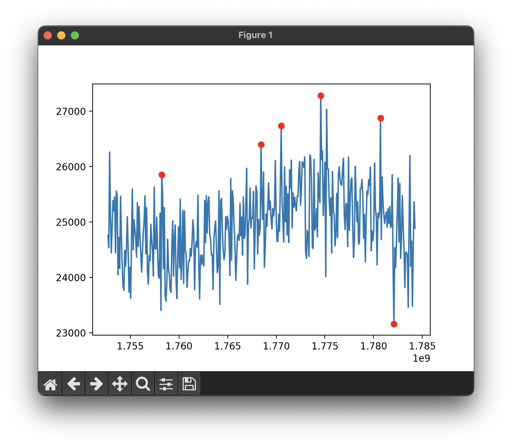

# Efficient Data Stream Anomaly Detection

## Task

> **Project Title:**
>
> Efficient Data Stream Anomaly Detection
>
> **Project Description:**
>
> Your task is to develop a Python script capable of detecting anomalies in a continuous data stream. This stream, simulating real-time sequences of floating-point numbers, could represent various metrics such as financial transactions or system metrics. Your focus will be on identifying unusual patterns, such as exceptionally high values or deviations from the norm.
>
> **Objectives:**
>
> 1. **Algorithm Selection:** Identify and implement a suitable algorithm for anomaly detection, capable of adapting to concept drift and seasonal variations.
> 2. **Data Stream Simulation:** Design a function to emulate a data stream, incorporating regular patterns, seasonal elements, and random noise.
> 3. **Anomaly Detection:** Develop a real-time mechanism to accurately flag anomalies as the data is streamed.
> 4. **Optimization:** Ensure the algorithm is optimized for both speed and efficiency.
> 5. **Visualization:** Create a straightforward real-time visualization tool to display both the data stream and any detected anomalies.
>
> **Requirements:**
>
> - The project must be implemented using Python 3.x.
> - Your code should be thoroughly documented, with comments to explain key sections.
> - Include a concise explanation of your chosen algorithm and its effectiveness.
> - Ensure robust error handling and data validation.
> - Limit the use of external libraries. If necessary, include a `requirements.txt` file.

## Approach

This project was completed using modules from The Python Standard Library only, with the single exception of `matplotlib` for data visualisation.

### Data Stream Simulation

To generate a simulated stream of data points, I wrote a function to procedurally generate energy data points (GWh) given a timestamp. This procedural function will always return the same energy value for the same timestamp, making it useful for getting the current energy value, going back in time to look at data points in the past, or 'predicting' any data point in the future.

This function generates a data point by combining the following 4 functions:

- **A seasonal function:** a $\sin$ function for representing seasonal cycles, with its default period being annual (365 days).
- **A regular function:** a $\sin$ function for representing regular cycles, with its default period being weekly (7 days).
- **A random function:** a gaussian random function to add noise to the data.
- **A constant Y offset:** a constant offset, which defaults to 25,000, to result in 'life-like' values (e.g. 23,501 GWh).

> Data generation code found in `./energy_data/data.py`.

### Algorithm selection and anomaly detection

To best select the algorithm for anomaly detection, we first need to consider the type of data we'll be working with. Since we'll be working with a continuous (simulated) data stream of a single variable, we're best off considering _univariate_ (one dimensional) anomaly detection methods, as opposed to anomaly detection done on _multivariate_ (multi dimensional) data.

> **Note**
>
> Technically, we're dealing with two variables; the data point received, _and_ the time we received it. However, for this assessment, I have assumed that data flow is constant—i.e. we'll get a data point at every step in time (even if it happens to be 0), and there will be no gaps or dropouts between streamed data points.
>
> If data flow was not constant, and the frequency of receiving data points varied, then this could be a second variable for identifying clusters or dropouts of data points.

Since we're dealing with univariate data, we can define an anomaly as: an extreme or abnormal value that deviates from the typical range of values for that specific feature.

#### Algorithms considered

The algorithms considered included Z-score, Grubb's test, and interquartile range-based algorithms.

- Z-score
  - Usually applied to a fixed set of data to find outliers. However, since we're dealing with an infinite stream of data, it would only make sense to calculate Z-scores on a rolling-window basis. This results in an $O(n)$ operation at each window, which is not the most efficient approach.
- Grubb's test
  - Usually applied to a fixed set of data to find outliers, and is only able to detect one outlier at a time. Therefore, similarly to the Z-score calculation, it would be computationally inefficient to test each data point for abnormality, resulting in an $O(n)$ calculation at each rolling-window.
- Interquartile range method

  - Usually applied to a fixed set of data to find outliers. Would include sorting the data to calculate its interquartile, and finding points that deviate significantly from the 1st and 3rd quartiles. Due to our infinite data stream, only a rolling-window calculation would make sense, which, due to the sorting required for the calculation, would be an $O(\log(n))$ operation at each rolling-window.

- Other, more complex, neural-network or machine learning based approaches were not considered for the sake of simplicity.

#### Algorithm chosen

Since all of the above approaches have to do a relatively costly calculation at each rolling window, I've decided to use a moving average approach. This approach is similar to the Z-score calculation, however, instead of looping through all data points at each rolling-window, it only checks the newest data point for abnormality.

At each rolling-window (excluding the initial one), the moving average and moving sample standard deviation is calculated in _constant time_ ($O(1)$) from their previous rolling-window values.

This chosen algorithm works as follows:

1. Calculate the sample mean and sample standard deviation in the current rolling window ($O(n)$ in first window, $O(1)$ in all subsequent windows).
2. The latest (right-most) value in the rolling-window is then tested for abnormality by checking its distance (in number of standard deviations) from the rolling mean:
   - $\frac{|x-M|}{s} > t$, where
     - $x$ is the value checked
     - $M$ is the sample mean of the rolling window
     - $s$ is the sample standard deviation of the rolling window
     - $t$ is the threshold (in number of standard deviations)
3. If the above equation is true, the value is marked as an anomaly.

> Anomaly detection code found in `./anomaly_detection/z_score.py`.

## Results

This approach has resulted in not only computationally efficient, but also effective anomaly detection.

